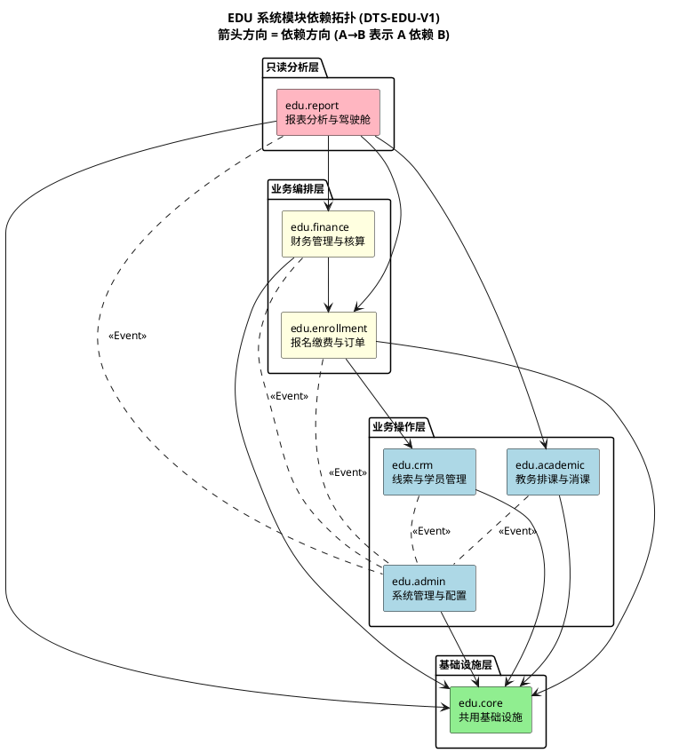

# DTS-EDU-V1: 依赖拓扑声明

**项目**: 培训机构教务收费管理系统 (EDU)
**DTS 编号**: DTS-EDU-V1
**版本**: V1
**日期**: 2026-06-24
**编制人**: A5-需求验证智能体（全量执行角色）
**关联文档**: ASD-EDU-V1 (§2.2 依赖约束) / MDS-EDU-V1 (§3 接口契约概要)

---

## 1. 依赖拓扑图 (PlantUML)



---

## 2. 依赖边声明

| 边 ID | 源模块 | 目标模块 | 方向 | 依赖类型 | 理由 |
|---|---|---|---|---|---|
| EDGE-001 | CRM | CORE | → | 编译期 | 使用共用基类/工具类/异常 |
| EDGE-002 | ACA | CORE | → | 编译期 | 使用共用基类/工具类/异常 |
| EDGE-003 | ADM | CORE | → | 编译期 | 使用共用基类/工具类/异常 |
| EDGE-004 | ENR | CORE | → | 编译期 | 使用共用基类/工具类/异常 |
| EDGE-005 | FIN | CORE | → | 编译期 | 使用共用基类/工具类/异常 |
| EDGE-006 | RPT | CORE | → | 编译期 | 使用共用基类/工具类/异常 |
| EDGE-007 | ENR | CRM | → | 编译期 | 报名需要读取学员信息 (`StudentService.getById`) |
| EDGE-008 | FIN | ENR | → | 编译期 | 财务台账依赖订单数据 (`OrderService.getByOrderNo`) |
| EDGE-009 | RPT | ENR | → | 编译期 | 报表跨模块只读查询招生/订单数据 |
| EDGE-010 | RPT | FIN | → | 编译期 | 报表跨模块只读查询营收/台账数据 |
| EDGE-011 | RPT | ACA | → | 编译期 | 报表跨模块只读查询排课/满班率数据 |
| EDGE-012 | ADM | ALL | ← | 运行时 (Event) | 审计日志异步消费——所有模块发出 `AuditEvent`，ADM 消费写入 |

---

## 3. 循环依赖验证

### 3.1 依赖矩阵

|  | CORE | CRM | ENR | ACA | FIN | RPT | ADM |
|---|---|---|---|---|---|---|---|
| **CORE** | — | — | — | — | — | — | — |
| **CRM** | ✅ | — | — | — | — | — | — |
| **ENR** | ✅ | ✅ | — | — | — | — | — |
| **ACA** | ✅ | — | — | — | — | — | — |
| **FIN** | ✅ | — | ✅ | — | — | — | — |
| **RPT** | ✅ | — | ✅ | ✅ | ✅ | — | — |
| **ADM** | ✅ | — | — | — | — | — | — |

> ✅ = 合法依赖（编译期或异步事件）

### 3.2 验证结论

| 检查项 | 结果 |
|---|---|
| **编译期循环依赖** | ✅ **无**——依赖图严格有向无环（DAG），按 CORE→CRM/ACA/ADM→ENR→FIN→RPT 单向流动 |
| **运行时循环依赖** | ✅ **无**——ADM 的审计日志消费通过 Spring Event 异步解耦（`.up.` 虚线），不形成编译期环路 |
| **违规依赖** | ✅ 无 |
| **ASD 一致性** | ✅ 与 ASD-EDU-V1 §2.2 依赖约束完全一致 |

---

## 4. 依赖变更审批规则

| 变更类型 | 需要审批 | 审批者 |
|---|---|---|
| 新增 CORE → 业务模块依赖 | ⚠️ **禁止** | — |
| 新增下游模块 → 上游模块依赖（如 FIN→ENR） | ✅ 需要 | CCB + 架构评审（ADR 记录） |
| 新增跨模块 RPT 只读依赖 | ✅ 需要 | CCB（确认无写操作） |
| 新增 ADM Event 消费 | ⚠️ 无需 | 架构团队知会 |
| 移除依赖 | ⚠️ 无需 | 更新本 DTS |

---

## 5. 违反依赖规则的自动检测方案

| 工具 | 检测内容 |
|---|---|
| **ArchUnit** | 编译期包依赖规则（`classes().that().resideInAPackage("..enrollment..").should().onlyDependOnClassesThat()...`） |
| **Maven/Gradle** | 模块级依赖白名单（`pom.xml` 中显式声明依赖，禁止隐式传递） |
| **CI Pipeline** | 每次 PR 运行 ArchUnit 测试，违规阻断合并 |

ArchUnit 规则示例（伪代码）：
```java
@AnalyzeClasses(packages = "com.meipao.edu")
public class DependencyArchTest {
    
    @ArchTest
    static final ArchRule core_no_biz_dep = classes()
        .that().resideInAPackage("..core..")
        .should().onlyDependOnClassesThat()
        .resideInAnyPackage("..core..", "java..", "org.springframework..");
    
    @ArchTest
    static final ArchRule no_cycles = slices()
        .matching("com.meipao.edu.(*)..")
        .should().beFreeOfCycles();
}
```

---

*本 DTS 基于 ASD-EDU-V1 §2.2 和 MDS-EDU-V1 §3 正式声明，图导出为 PlantUML 组件图（与 UML 模型风格一致）。属于期末考核第 2 项交付物（D12 工程产物定义）。*
